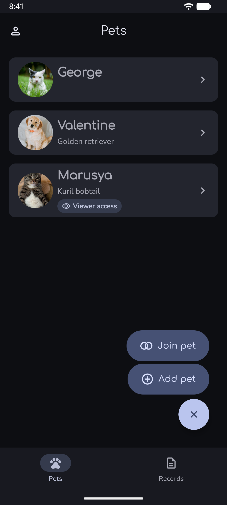
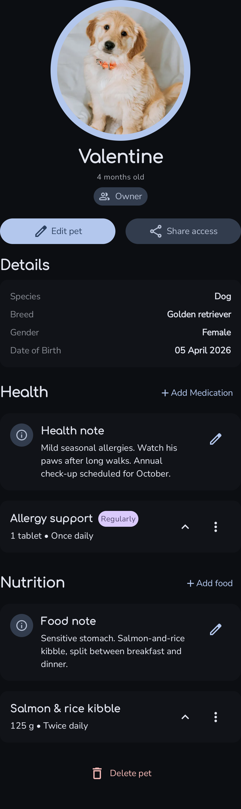
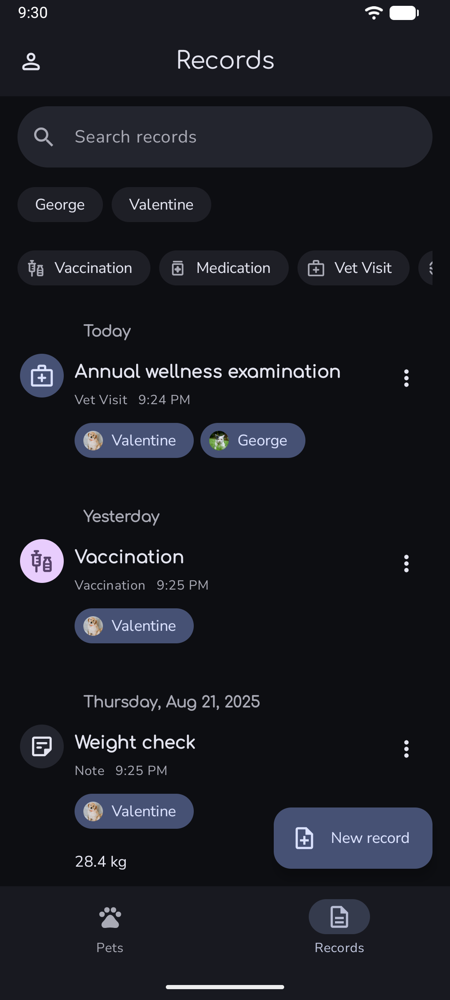
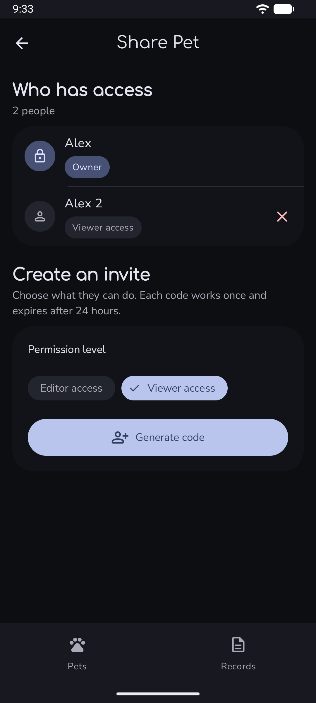

# PetVitals

<p >
  An Android app for keeping pet profiles, care information, medications, food, and health records in one place.
</p>

> [!NOTE]
> **Project status: Paused.** This repository is not under active development for now. It remains available as my diploma project, learning record, and portfolio reference.

## About the project

PetVitals is a personal learning project that started as my diploma work. I built it to practice modern Android development and to explore how a larger application can be organized around Jetpack Compose, Firebase, dependency injection, coroutines, and automated tests.

Development is currently paused. The project remains useful as a portfolio and learning reference, but it should not be treated as a production-ready veterinary or medical system.

## Features

- Email and password authentication, registration, and password reset
- Pet profiles with species, breed, sex, date of birth, and avatar
- Health and food notes for each pet
- Medication and food tracking
- Chronological health records that can be linked to multiple pets
- Record filtering, grouping, editing, and permission-aware deletion
- Pet access management with Owner, Editor, and Viewer roles
- Experimental invite-code creation and redemption for sharing pets
- User profile and account management
- Material 3 UI with dynamic color, light theme, and dark theme
- English and Russian resources

## Screenshots

<p >
  
  
  
  
</p>

## Screens

The application currently includes:

- Splash, login, signup, and password-reset flows
- Pets list and pet profile
- Add and edit pet
- Food and medication management
- Records timeline and record editor
- Share Pet access management
- Join Pet by invite code
- User profile

## Tech stack

| Area | Technology |
| --- | --- |
| Language | Kotlin |
| UI | Jetpack Compose, Material 3 |
| Architecture | ViewModel, StateFlow, use cases, repositories |
| Dependency injection | Hilt with KSP |
| Navigation | Navigation Compose with typed routes |
| Asynchronous work | Kotlin coroutines and Flow |
| Authentication | Firebase Authentication |
| Database | Cloud Firestore |
| Image loading | Coil |
| Logging | Timber |
| Testing | JUnit, coroutine test utilities, Compose UI tests |

## Architecture

PetVitals is a single-module Android application. The codebase is gradually moving toward clearer Clean Architecture boundaries while retaining some legacy code.

```text
app/src/main/java/com/example/petvitals/
|-- data/       Firebase services, repository implementations, mappers
|-- di/         Hilt modules and dependency bindings
|-- domain/     Models, repository contracts, validators, use cases
|-- ui/         Compose screens, components, navigation, theme, ViewModels
|-- MainActivity.kt
`-- PetVitalsHiltApp.kt
```

The intended dependency direction is:

```text
UI -> domain contracts -> data implementations -> Firebase
```

UI state is generally exposed from ViewModels through immutable `StateFlow`. One-off navigation and snackbar results use explicit events or callback contracts. Permission-sensitive and multi-step operations are progressively being moved into use cases.

## Requirements

- Android Studio compatible with Android Gradle Plugin 9.3
- JDK 17
- Android SDK 37
- An emulator or physical device running Android 8.0 (API 26) or newer
- A Firebase project

## Firebase setup

1. Create a project in the [Firebase Console](https://console.firebase.google.com/).
2. Add an Android application with package name `com.example.petvitals`.
3. Download `google-services.json` and place it at:

   ```text
   app/google-services.json
   ```

4. Enable Email/Password authentication in Firebase Authentication.
5. Create a Cloud Firestore database.
6. Configure Firestore security rules and any required indexes before running sharing or data-management flows.

`google-services.json` is intentionally excluded from version control.

> [!IMPORTANT]
> This repository does not currently include deployable Firestore rules or index configuration. Client-side permission checks are not a security boundary. Do not connect the app to production or sensitive data without restrictive, tested server-side rules.

## Getting started

Clone the repository:

```bash
git clone https://github.com/ETO-YTKA/petvitals.git
cd petvitals
```

Complete the Firebase setup above, open the project in Android Studio, sync Gradle, and run the `app` configuration.

You can also build from the command line.

Windows:

```powershell
.\gradlew.bat :app:assembleDebug
```

macOS or Linux:

```bash
./gradlew :app:assembleDebug
```

The debug APK is written under `app/build/outputs/apk/debug/`.

## Testing

Run JVM unit tests:

```powershell
.\gradlew.bat :app:testDebugUnitTest
```

Compile Android and Compose tests:

```powershell
.\gradlew.bat :app:compileDebugAndroidTestKotlin
```

Run Android tests on a connected emulator or device:

```powershell
.\gradlew.bat :app:connectedDebugAndroidTest
```

Run Android lint:

```powershell
.\gradlew.bat :app:lintDebug
```

The test suite covers domain validation, use cases, mapping, ViewModel state, record persistence behavior, invite-code handling, and selected Compose interactions.

## What I learned

This project has been a practical way to learn and revisit:

- Declarative UI and state management with Jetpack Compose
- Lifecycle-aware state with ViewModels, StateFlow, and coroutines
- Firebase Authentication and Firestore data modeling
- Role-based access and the difference between UI guards and server authorization
- Dependency injection with Hilt
- Typed navigation and multi-screen application structure
- Unit, coroutine, and Compose UI testing
- Incrementally refactoring legacy code toward cleaner boundaries

## Project status

Active development is paused, and no regular updates or maintenance are planned for now. The repository is preserved as the result of my diploma work and as a record of what I learned while building it.

Some areas remain experimental or incomplete, especially pet sharing, invite lifecycle management, and Firestore authorization. The data model may change without migration support if development resumes in the future.

This application does not provide veterinary advice and should not be used as the sole storage location for important medical information.
